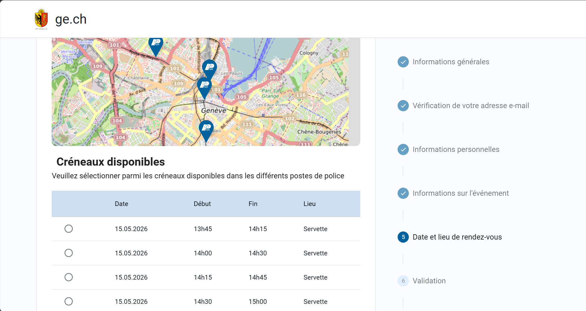

# Pré-plainte

- [Présentation de l'application](#présentation-de-lapplication)
- [Liste des modules](#liste-des-modules)
- [Construction](#construction)
- [Démarrage](#démarrage)
- [Livraison](#livraison)
- [Astuces](#astuces)

# Présentation de l'application

L’objectif principale de cette application est de simplifier le processus autour des dépôts de plainte pour les plaignants et faciliter le traitement par les ASP/Policiers. L’application pré-plainte en ligne est une application web de type e-démarche. Elle fonctionne sans authentification et permet à quiconque de pré déposer une plainte depuis n’importe où avec une connexion internet et un smartphone/tablette/ordinateur.

Concrètement, l’application permet de :

1.	Saisir ses informations personnelles, celles d’un tiers ou celles d’une personne morale.
2.	Vérifier l’adresse e-mail de l’utilisateur via l’envoi d’un code sécurisé et une validation CAPTCHA.
3.	Aider à la saisie grâce à des listes de références métier, utilisation de codes RIPOL « Recherches Informatisées de Police » pour faciliter et fiabiliser certaines informations (mapping avec le backoffice Police MyAbi).
4.	Prendre un rendez-vous dans un poste de police en utilisant le service de gestion des RDV eSirius via une API.
5.	Enregistrer un brouillon et le reprendre plus tard à l’aide d’un numéro envoyé par email.
6.	Générer un document PDF résumant l’ensemble des informations saisies.

Le projet repose sur :

- un backend Spring Boot en architecture hexagonale ;
- un frontend Vue 3 / TypeScript / Vuetify ;
- des tests d'intégration frontend avec Cypress ;
- une documentation technique dédiée dans un module séparé.




# Liste des modules

- [pre-plainte-ihm](./pre-plainte-ihm) : interface web du formulaire de pré-plainte destinée aux citoyens.
- [pre-plainte-core](./pre-plainte-core) : coeur métier et cas d'usage de l'application.
- [pre-plainte-infrastructure](./pre-plainte-infrastructure) : implémentations techniques des ports sortants.
- [pre-plainte-rest](./pre-plainte-rest) : exposition REST et point d'entrée Spring Boot de l'application.
- [pre-plainte-cypress](./pre-plainte-cypress) : scénarios de tests d'intégration frontend.
- [pre-plainte-doc](./pre-plainte-doc) : documentation technique du projet.

Pour le détail de l'architecture backend, voir le [README du module `pre-plainte-core`](./pre-plainte-core/README.md).

# Construction

## Pré-requis

- JDK 21
- Maven
- Node.js 22+

## Comment construire

```bash
mvn clean install
```

# Démarrage

## Application complète

Pour démarrer le backend Spring Boot :

```bash
cd pre-plainte-rest
mvn spring-boot:run
```

Le backend expose ses endpoints sous `/api`, par exemple :

- `/api/preplainte`
- `/api/email-challenges`
- `/api/ripol`
- `/api/esirius`

L'application web packagée est servie par le backend via les ressources statiques.

## Frontend seul

Pour démarrer uniquement le frontend en local :

```bash
cd pre-plainte-ihm
npm run dev
```

L'application web sera disponible sur :

```text
http://localhost:5173/
```

# Livraison

La stratégie de branching de l'application est [Gitflow][gitflow].

Le projet contient une configuration GitLab CI/CD et SonarQube à la racine du dépôt.

# Astuces

## Tests Cypress

Le module [`pre-plainte-cypress`](./pre-plainte-cypress) contient les scénarios de tests d'intégration frontend.

Pour ouvrir l'interface graphique de Cypress :

```bash
cd pre-plainte-cypress
npm run cy:open
```

Voir le [README du module Cypress](./pre-plainte-cypress/README.md) pour les détails d'installation et d'exécution.

## Documentation projet

La documentation technique est centralisée dans le module [`pre-plainte-doc`](./pre-plainte-doc).

## Style du code

Le style du code est défini par le fichier [.editorconfig](./.editorconfig) à la racine du projet.

Pour certains IDE, il faut installer un plugin permettant son intégration.

L'information sur le format, les IDE et les plugins compatibles se trouve sur :

```text
https://editorconfig.org
```

[gitflow]: https://danielkummer.github.io/git-flow-cheatsheet/
