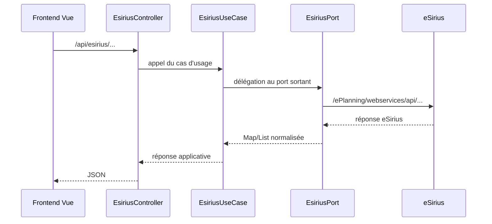

# Communication avec eSirius pour la prise de rendez-vous

## Objectif

La prise de rendez-vous de la pré-plainte s'appuie sur eSirius pour :

- récupérer les services et les créneaux disponibles ;
- créer un rendez-vous lors de la validation de la pré-plainte ;
- consulter un rendez-vous existant à partir de son code ;
- annuler un rendez-vous ;
- modifier le créneau d'un rendez-vous existant.

Le frontend ne communique jamais directement avec eSirius. Il appelle le backend sur `/api/esirius`, qui joue le rôle de proxy applicatif vers les endpoints eSirius.

## Vue d'ensemble



## Responsabilités par couche

### Frontend

Le service `pre-plainte-ihm/src/services/esiriusService.ts` centralise les appels HTTP vers le backend :

- `GET /api/esirius/sites/{siteCode}/listServices` ;
- `GET /api/esirius/sites/{siteCode}/services/{serviceId}/plannings/begins/{begin}/periods/{period}/availabilities` ;
- `POST /api/esirius/appointments` ;
- `GET /api/esirius/appointments/{codeRdv}` ;
- `DELETE /api/esirius/appointments/{codeRdv}` ;
- `PUT /api/esirius/appointments`.

Le store `useEsiriusStore` porte l'état de chargement, les erreurs, les services, les disponibilités et le rendez-vous courant.

Les payloads eSirius sont construits dans `pre-plainte-ihm/src/utils/helpers/esiriusFormatBuilder.ts` :

- `buildEsiriusPayload` pour la création ;
- `buildUpdateAppointmentPayload` pour la modification.

### Backend REST

`EsiriusController` expose l'API interne `/api/esirius`. Il ne contient pas de logique métier : il transmet les paramètres et les corps JSON au cas d'usage `EsiriusUseCase`.

### Coeur applicatif

`EsiriusService` implémente `EsiriusUseCase` et délègue les opérations au port sortant `EsiriusPort`.

Le port sortant définit les opérations nécessaires :

- `getAllSites` ;
- `getServiceListBySiteCode` ;
- `getAvailabilityBySiteCode` ;
- `createAppointment` ;
- `getInfoByRdvCode` ;
- `cancelAppointmentByRdvCode` ;
- `updateAppointmentByRdvCode`.

### Infrastructure

`EsiriusWebClientAdapter` implémente `EsiriusPort` avec un `WebClient` configuré pour eSirius.

La configuration se fait avec les propriétés :

- `esirius.base_url`, alimentée par `ESIRIUS_BASE_URL` ;
- `esirius.username`, alimentée par `ESIRIUS_USERNAME` ;
- `esirius.password`, alimentée par `ESIRIUS_PASSWORD`.

Le client ajoute les en-têtes suivants vers eSirius :

- `Accept: application/json; charset=utf-8` ;
- `Content-Type: application/json; charset=utf-8` ;
- `Authorization: Basic ...` ;
- `language: fr` et `country: fr` pour les créations et modifications de rendez-vous.

Les appels sont journalisés avec `event=esirius_request_start`, `event=esirius_request_success` ou `event=esirius_request_failure`, ainsi que le `traceId`, la méthode, le chemin, le statut et la durée.

## Correspondance des endpoints

| Besoin | Endpoint backend | Endpoint eSirius |
| --- | --- | --- |
| Lister les sites | `GET /api/esirius/sites` | `GET /ePlanning/webservices/api/sites` |
| Lister les services d'un site | `GET /api/esirius/sites/{siteCode}/listServices` | `GET /ePlanning/webservices/api/sites/{siteCode}/listServices` |
| Lister les créneaux disponibles | `GET /api/esirius/sites/{siteCode}/services/{serviceId}/plannings/begins/{begin}/periods/{period}/availabilities` | `GET /ePlanning/webservices/api/sites/{siteCode}/services/{serviceId}/plannings/begins/{begin}/periods/{period}/availabilities` |
| Créer un rendez-vous | `POST /api/esirius/appointments` | `POST /ePlanning/webservices/api/appointments` |
| Consulter un rendez-vous | `GET /api/esirius/appointments/{codeRdv}` | `GET /ePlanning/webservices/api/appointments/{codeRdv}` |
| Annuler un rendez-vous | `DELETE /api/esirius/appointments/{codeRdv}` | `DELETE /ePlanning/webservices/api/appointments/{codeRdv}` |
| Modifier un rendez-vous | `PUT /api/esirius/appointments` | `PUT /ePlanning/webservices/api/appointments` |

## Chargement des disponibilités

La page de rendez-vous appelle au montage :

1. `loadServicesForSite("PPEL")` pour récupérer les services du site PPEL.
2. `loadAllAvailabilitiesForPPEL()` pour récupérer les créneaux disponibles.

`loadAllAvailabilitiesForPPEL` :

- utilise PPEL comme site ;
- prend par défaut une date de début à maintenant plus une heure ;
- récupère les services dont `existAvailabilities` est vrai ;
- appelle eSirius pour chaque service disponible ;
- agrège les disponibilités par service dans `allAvailabilities`.

La période par défaut transmise au backend est `15`.

Les créneaux affichés sont ensuite filtrés côté frontend selon :

- le type d'incident de la pré-plainte ;
- le poste choisi ;
- la date souhaitée ;
- la fenêtre glissante de rendez-vous ;
- la règle spécifique aux vols de véhicule avec plaque, qui limite le rendez-vous aux prochaines 24 heures.

Le créneau retenu est stocké dans le formulaire sous `selectedCreneau` avec les informations utiles à la création eSirius : date, heure de début, heure de fin, lieu, service, site, ressource et valeurs brutes `beginDateTime` / `endDateTime`.

## Création du rendez-vous

La création eSirius intervient lors de la validation finale de la pré-plainte, après la soumission de la pré-plainte au backend.

Flux :

1. Le frontend construit les données de pré-plainte et les envoie au backend métier.
2. Le backend retourne un `demandeId`.
3. Si `selectedCreneau` est présent, le frontend construit le payload eSirius avec `buildEsiriusPayload`.
4. Le frontend appelle `POST /api/esirius/appointments`.
5. Le backend transmet le payload à eSirius.
6. Si eSirius retourne un code de rendez-vous, il est stocké dans `selectedCreneau.codeRdv` et `codeRdv`.

Le payload de création contient notamment :

- `beginDate`, `beginTime`, `endDate`, `endTime` ;
- `user.lastName`, `user.firstName`, `user.personalIdentity`, `user.birthday`, `user.email`, `user.phone` ;
- `user.address` ;
- `serviceId` ;
- `siteCode` ;
- `resources` ;
- `motives`.

`user.personalIdentity` reçoit le `demandeId`, ce qui permet de rattacher le rendez-vous eSirius à la pré-plainte.

Si eSirius retourne une réponse texte non JSON, l'adapter backend l'interprète comme un code de rendez-vous et renvoie :

```json
{
  "code": 200,
  "codeRdv": "..."
}
```

Si aucun `codeRdv` n'est reçu côté frontend, le créneau est considéré comme indisponible et l'utilisateur est invité à sélectionner un autre rendez-vous.

## Modification du rendez-vous

Le parcours de modification commence par la saisie du code de rendez-vous.

Flux :

1. Le frontend vérifie le code avec `GET /api/esirius/appointments/{codeRdv}`.
2. Le rendez-vous retourné est stocké comme rendez-vous courant.
3. Les disponibilités PPEL sont rechargées.
4. Le frontend filtre les créneaux compatibles avec le type d'incident déduit de `appointment.user.personalIdentity`.
5. L'utilisateur sélectionne un nouveau créneau.
6. `buildUpdateAppointmentPayload` reconstruit un payload complet en conservant les informations du rendez-vous existant et en remplaçant les dates, horaires, service, site et ressource.
7. Le frontend appelle `PUT /api/esirius/appointments`.

Le payload de modification conserve notamment :

- `idSys` ;
- `codeRDV` ;
- les informations utilisateur existantes ;
- `comment` ;
- `needsConfirmation` ;
- `rdvChannel` ;
- `siteIdSys` ;
- `motives`.

La modification ne se limite donc pas à envoyer le nouveau créneau : elle renvoie à eSirius une représentation complète du rendez-vous avec les champs nécessaires à sa mise à jour.

## Annulation du rendez-vous

Le parcours d'annulation demande :

- le code de rendez-vous ;
- une validation FriendlyCaptcha ;
- une confirmation explicite de l'utilisateur.

Flux :

1. Le frontend vérifie l'existence du rendez-vous avec `GET /api/esirius/appointments/{codeRdv}`.
2. Si le code existe, il appelle `DELETE /api/esirius/appointments/{codeRdv}`.
3. Le backend transmet la suppression à eSirius.
4. Le frontend affiche un message de succès ou d'erreur.

Une réponse eSirius vide lors d'une annulation est convertie par l'adapter backend en réponse applicative avec le code `204` et un message de confirmation.

## Gestion des erreurs et formats de réponse

L'adapter backend ne propage pas directement les exceptions `WebClientResponseException`. Il convertit les erreurs eSirius en payloads JSON :

```json
{
  "code": 400,
  "details": "..."
}
```

Pour les erreurs non HTTP, il renvoie :

```json
{
  "code": 500,
  "details": "..."
}
```

Côté frontend, `EsiriusService` transforme les statuts HTTP non OK en erreurs utilisateur avec `getUserFacingApiErrorMessage`.

Le store `useEsiriusStore` traite aussi les réponses JSON contenant un champ `code` supérieur ou égal à `400` comme des erreurs fonctionnelles pour la consultation, l'annulation et la modification.

## Points de vigilance

- Le backend expose des `Map<String, Object>` et relaie le format eSirius. Toute évolution du contrat eSirius doit être vérifiée côté frontend et backend.
- Le site utilisé par défaut pour les créneaux est `PPEL`.
- Le format `beginDateTime` / `endDateTime` attendu côté frontend est manipulé par découpage de chaîne. Une modification de format eSirius peut casser le filtrage ou la construction des payloads.
- La création du rendez-vous est effectuée après la création de la pré-plainte. Une indisponibilité eSirius peut donc laisser une pré-plainte créée sans rendez-vous confirmé.
- Les erreurs eSirius peuvent être renvoyées avec un statut HTTP OK côté backend si elles sont encapsulées dans un objet `{ code, details }`. Le frontend doit continuer à vérifier ce champ `code`.
- Les credentials eSirius ne doivent jamais être exposés côté frontend.
- Les logs ne doivent pas contenir de données personnelles issues du payload de rendez-vous.
