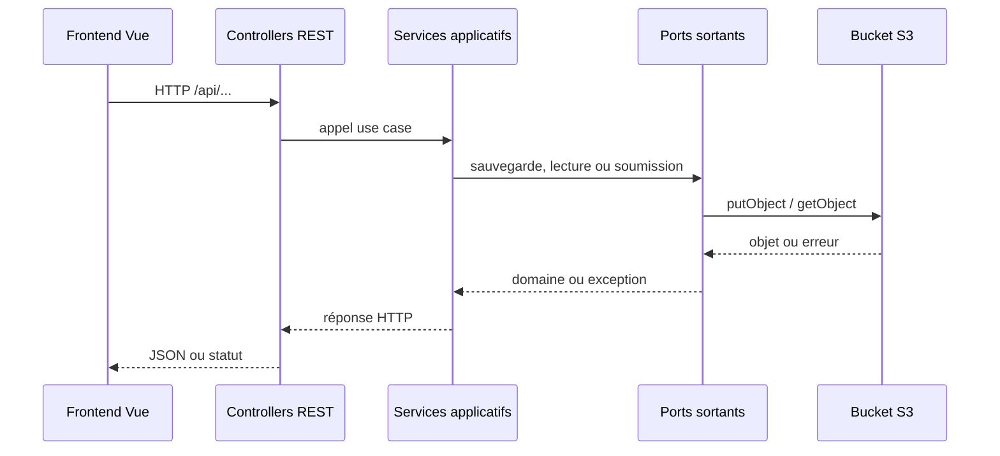

# Stockage S3

## Objectif

Le backend utilise S3 comme stockage objet pour les données applicatives qui doivent survivre au cycle de vie des pods OpenShift.

Les usages actuels sont :

- sauvegarder et relire les brouillons de pré-plainte ;
- sauvegarder et relire les challenges de vérification e-mail ;
- déposer le document XML eCH-0051 produit lors de la soumission finale.

Le frontend ne communique jamais directement avec S3. Il appelle les endpoints REST du backend, qui passent par les ports applicatifs et les adapters d'infrastructure.

## Choix du S3

S3 est retenu car le besoin principal est du stockage d'objets, pas du stockage fichier partagé.

Les objets stockés sont des documents autonomes :

- JSON de brouillon ;
- JSON de challenge e-mail ;
- XML eCH-0051 final.

Ce modèle s'intègre très bien avec OpenShift :

- les pods restent stateless ;
- aucun fichier métier n'est dépendant du filesystem local d'un pod ;
- un redémarrage, un rescheduling ou une montée en charge ne fait pas perdre les objets ;
- plusieurs instances de l'application peuvent lire et écrire dans le même bucket ;
- les credentials et endpoints sont injectés par configuration d'environnement ;
- les politiques de rétention, sauvegarde, chiffrement et accès peuvent être gérées côté plateforme.

Un volume physique est moins adapté pour ce cas :

- il introduit un couplage plus fort entre l'application, le pod et l'infrastructure de stockage ;
- il est moins naturel pour des documents JSON/XML indépendants ;
- il complique les accès concurrents entre plusieurs réplicas ;
- il nécessite souvent plus de conventions applicatives pour organiser, purger et sécuriser les fichiers ;
- il apporte peu de valeur pour des objets adressés par clé.

S3 correspond donc mieux à la nature des données manipulées : des objets complets, identifiés par une clé, écrits puis relus sans besoin de montage filesystem.

## Vue d'ensemble



## Configuration

La configuration S3 est déclarée dans `pre-plainte-rest/src/main/resources/application.properties`.

| Propriété | Variable d'environnement | Rôle |
| --- | --- | --- |
| `s3.bucket.name` | `S3_BUCKET_NAME` | Nom du bucket cible. |
| `s3.endpoint` | `S3_ENDPOINT` | Endpoint S3 utilisé par le client. |
| `s3.access.key` | `S3_ACCESS_KEY` | Access key du compte technique. |
| `s3.secret.key` | `S3_SECRET_KEY` | Secret key du compte technique. |
| `s3.debug.enabled` | `S3_DEBUG_ENABLED` | Active les endpoints de debug S3. Désactivé par défaut. |

Le bean `S3Config` construit un `S3Client` AWS SDK v2 avec :

- un endpoint explicite via `endpointOverride` ;
- la région `eu-west-1` ;
- des credentials statiques ;
- un client HTTP Apache ;
- le mode path-style activé ;
- les checksums configurés en mode `WHEN_REQUIRED`.

Le client désactive la prise en compte automatique des proxies système et environnement pour sa configuration HTTP.

## Dépendance technique

Le module `pre-plainte-infrastructure` porte les dépendances S3 :

- `software.amazon.awssdk:s3` ;
- `software.amazon.awssdk:apache-client`.

Ces dépendances restent dans l'infrastructure. Le coeur applicatif ne dépend pas du SDK AWS.

## Séparation hexagonale

Le stockage S3 est isolé derrière des ports sortants.

| Besoin | Port coeur | Adapter infrastructure |
| --- | --- | --- |
| Brouillons de pré-plainte | `PrePlainteBrouillontPort` | `S3JsonDraftAdapter` |
| Challenges e-mail | `EmailChallengeStoragePort` | `S3ChallengeEmailAdapter` |
| Soumission eCH-0051 | `PrePlainteSubmissionPort` | `Ech051Adapter` |

Les services applicatifs manipulent des modèles métier (`PrePlainte`, `EmailChallenge`) et ne connaissent pas les clés S3, le bucket ou le SDK.

## Objets stockés

| Usage | Clé S3 | Type de contenu | Adapter |
| --- | --- | --- | --- |
| Brouillon | `preplainte/draft/{demandeId}.json` | `application/json` | `S3JsonDraftAdapter` |
| Challenge e-mail | `preplainte/email-challenge/{key}.json` | `application/json` | `S3ChallengeEmailAdapter` |
| Soumission finale eCH-0051 | `preplainte/preplainte-{yyyyMMdd}-{uuid}.xml` | `application/xml` | `Ech051Adapter` |

## Brouillons de pré-plainte

### Sauvegarde

Le frontend appelle :

```http
POST /api/preplainte/draft
```

avec le payload complet de pré-plainte et le token FriendlyCaptcha.

Le controller :

1. valide les fichiers joints avec `FichierValidator` ;
2. appelle `PrePlainteUseCase.enregistrerPrePlainteEnModeBrouillon` ;
3. envoie un e-mail contenant le lien de reprise.

Le service applicatif :

1. réutilise le `demandeId` existant s'il est présent ;
2. sinon génère un nouveau `demandeId` selon le type d'incident ;
3. stocke la pré-plainte via `PrePlainteBrouillontPort`.

`S3JsonDraftAdapter` sérialise le modèle `PrePlainte` en JSON pretty-print et l'écrit avec :

```text
bucket = s3.bucket.name
key = preplainte/draft/{demandeId}.json
contentType = application/json
```

Le JSON contient la pré-plainte telle que représentée côté domaine au moment de la sauvegarde. Il peut donc inclure :

- les informations personnelles ;
- les informations d'incident ;
- les informations de rendez-vous déjà saisies ;
- les fichiers joints encodés en base64 dans les champs `Fichier`, si présents.

### Reprise

Le frontend appelle :

```http
GET /api/preplainte/draft/{demandeId}
```

Le backend lit l'objet `preplainte/draft/{demandeId}.json`, le désérialise en `PrePlainte` et le renvoie au frontend.

Si l'objet n'existe pas, l'adapter lève `S3NotFoundException`. Les erreurs d'accès ou de désérialisation sont converties en `S3AccessException`.

## Challenges de vérification e-mail

Les challenges e-mail servent à vérifier l'adresse e-mail avant la soumission finale.

Le frontend appelle :

```http
POST /api/email-challenges/request
POST /api/email-challenges/verify
```

L'objet stocké est un `EmailChallenge` sérialisé en JSON.

Il contient :

- `email` ;
- `codeHash` ;
- `createdAt` ;
- `lastCodeSentAt` ;
- `expiresAt` ;
- `attempts` ;
- `verified`.

Le code envoyé par e-mail n'est pas stocké en clair. Seul son hash BCrypt est sauvegardé dans `codeHash`.

La clé S3 est construite ainsi :

```text
preplainte/email-challenge/{key}.json
```

La durée de validité et les limites sont configurées par :

- `mail.challenge.codeLength` ;
- `mail.challenge.codeTtlDays` ;
- `mail.challenge.maxAttempts`.

Le service applicatif applique aussi un délai minimal de deux minutes avant le renvoi d'un nouveau code non expiré.

Lors de la vérification :

1. le challenge est chargé depuis S3 ;
2. l'e-mail est comparé ;
3. l'expiration et le nombre d'essais sont contrôlés ;
4. le code fourni est comparé au hash BCrypt ;
5. l'objet est réécrit avec le nombre d'essais incrémenté et, en cas de succès, `verified=true`.

## Soumission finale eCH-0051

Le frontend appelle :

```http
POST /api/preplainte/soumission
```

Le controller valide les fichiers joints, puis le service applicatif :

1. génère ou réutilise le `demandeId` ;
2. valide les champs métier de la pré-plainte ;
3. génère le PDF récapitulatif et l'attache au modèle `PrePlainte` ;
4. appelle `PrePlainteSubmissionPort`.

`Ech051Adapter` génère le XML eCH-0051 via `Ech051Builder`, puis écrit l'objet dans S3.

La clé est générée avec la date du jour et un UUID :

```text
preplainte/preplainte-{yyyyMMdd}-{uuid}.xml
```

Le type de contenu est :

```text
application/xml
```

Le XML peut contenir des pièces jointes sous forme de contenu base64, selon les fichiers présents dans la pré-plainte et le mapping eCH-0051.

## Endpoints de debug S3

`DevS3Controller` expose des endpoints techniques sous :

```http
/api/dev-s3
```

Ils ne sont disponibles que si :

```properties
s3.debug.enabled=true
```

Endpoints :

- `GET /api/dev-s3/objects` liste les objets du bucket, avec `prefix`, `maxKeys` et `continuationToken` optionnels ;
- `GET /api/dev-s3/objects/{key}` télécharge un objet S3.

Ces endpoints doivent rester désactivés hors contexte de debug contrôlé. Ils donnent accès au contenu du bucket applicatif.

## Gestion des erreurs

Les adapters distinguent les erreurs de type "objet absent" des autres erreurs.

Pour les brouillons :

- `NoSuchKeyException` ou statut S3 `404` devient `S3NotFoundException` ;
- les autres `S3Exception` deviennent `S3AccessException` ;
- les erreurs de sérialisation ou désérialisation deviennent aussi `S3AccessException`.

Pour les challenges e-mail :

- un objet absent retourne `Optional.empty()` ;
- les autres erreurs S3 ou JSON lèvent `ChallengeStorageException`.

Pour l'export eCH-0051 :

- une erreur S3 ou XML lève `IllegalStateException`.

Les logs sont structurés avec les événements suivants :

- `preplainte_draft_save_success` ;
- `preplainte_draft_save_failure` ;
- `preplainte_draft_load_success` ;
- `preplainte_draft_load_failure` ;
- `preplainte_draft_not_found` ;
- `email_challenge_save_success` ;
- `email_challenge_save_failure` ;
- `email_challenge_load_success` ;
- `email_challenge_load_failure` ;
- `email_challenge_not_found` ;
- `ech051_export_success` ;
- `ech051_export_failure`.

Les logs incluent notamment le `traceId`, le bucket, la clé S3 et parfois le `demandeId`. Les données personnelles et le contenu des fichiers ne doivent pas être loggés.

## Sécurité et données stockées

Le bucket contient des données sensibles :

- données personnelles du déclarant ;
- informations d'incident ;
- pièces jointes éventuelles en base64 ;
- hash de code de challenge e-mail ;
- XML final de pré-plainte.

Points de vigilance :

- les credentials S3 doivent rester dans les variables d'environnement ou les secrets de plateforme ;
- le frontend ne doit jamais recevoir de credentials S3 ;
- `s3.debug.enabled` doit rester désactivé par défaut ;
- les politiques de bucket doivent limiter les accès au strict compte technique de l'application ;
- la rétention des brouillons doit être alignée avec la durée annoncée à l'utilisateur dans les e-mails de brouillon ;
- les objets eCH-0051 doivent être traités comme des documents métier sensibles.

## Points de maintenance

- Toute évolution de `PrePlainte` impacte le format JSON des brouillons.
- Toute évolution de `EmailChallenge` impacte les challenges déjà stockés.
- Toute évolution du mapping eCH-0051 impacte le XML déposé dans S3.
- Les clés S3 sont construites dans les adapters ; ne pas dupliquer ces conventions côté controller ou frontend.
- Pour ajouter un nouvel usage de stockage, créer un port dans le coeur applicatif et un adapter S3 dans l'infrastructure.
